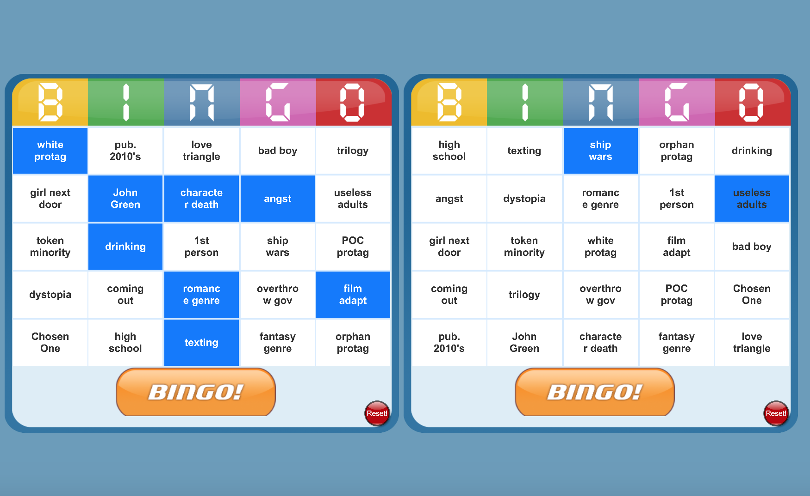
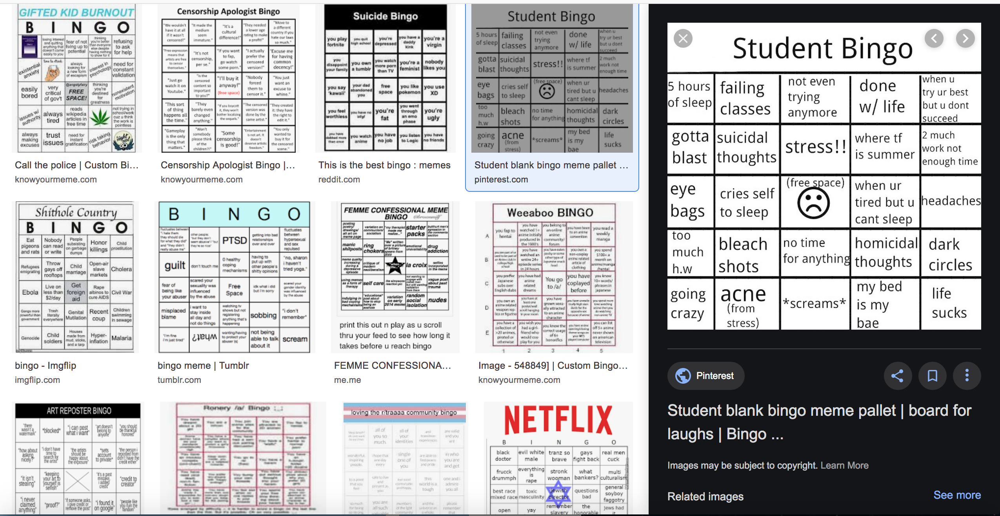

# Unity Meme Bingo
-Abby Chen & Sophie Debs for CS98 hack-a-thing-2

### What we did

We created randomly generated bingo cards in Unity. Instead of the typical B-12, I-25 fare the player can create meme bingo cards (which are memes in themselves - memeception!) A glance at the many varieties on meme bingo online:

Our pictured example is YA novel tropes bingo.

Who did what:
Abby set up the assets and stripped the extraneous capabilities.
Sophie added the reset functionality.
We worked together to convert the bingo numbers to insertable text, randomize it, and generate some content.

### What we learned

* C# is really similar to Java.
* Unity has a combination of coding and drag and drop interfaces that can get confusing at times.
  * In particular, a lot of code changes _needed_ to be accompanied by drag-and-drop alterations, and a lot of functionality isn't available in the UI without code setup for it. These connections are not made particularly clear, and there don't seem to be workarounds in the Unity client.
* Visual Studio Code is your BFF -- it's difficult to draw lines between how different script files interface from the Unity UI, and opening the files 1 by 1 is unwieldy. VS Code (especially with the C# library support) is helpful in providing search functionality and noting the connections between files. 
* Adding and removing capabilities from assets can be really complicated, especially if the code base is messy.

### Inspiration for future projects

* Game ideas can be fun to implement.
* Unity is pretty cool!

### What didn't work
* There are options for 1-4 bingo cards (and they do work) but our current UI is only visually optimized for 2 cards at the moment.

### Acknowledgements
We adapted a free Unity Asset, Brilliant Bingo Kit: https://assetstore.unity.com/packages/templates/packs/brilliant-bingo-kit-36436

We also looked into:
https://github.com/sermmor/Bingo
